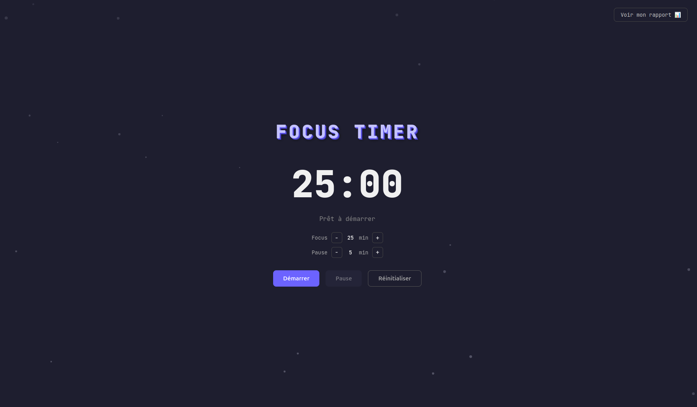

# 🎯 Focus Timer — avec journal de distractions

Un Pomodoro qui ne se contente pas de décompter le temps : il **traque tes distractions** pour t'aider à comprendre tes vrais patterns de concentration.

🔗 **[Voir la démo en ligne](https://dalobaminthe.github.io/Focus-timer_distractions/)**



## 💡 Pourquoi ce projet

La plupart des Pomodoro timers se contentent de décompter le temps. Celui-ci va plus loin : quand tu quittes l'onglet pendant une session de focus, l'app te demande **pourquoi** (notification, faim, fatigue...) et garde un historique. Résultat : un mini-rapport qui révèle tes vraies sources de distraction, pas juste un chiffre brut.

**Choix de design assumé** : le minuteur continue de tourner même quand tu quittes la page. C'est volontaire — l'objectif est de responsabiliser l'utilisateur sur le temps réellement perdu, pas de figer artificiellement le compteur.

## ✨ Fonctionnalités

- Timer focus/pause avec cycle automatique
- Durées personnalisables (focus et pause ajustables)
- Détection automatique des changements d'onglet pendant une session
- Journal des distractions avec raison et durée
- Sauvegarde persistante (localStorage)
- Rapport visuel : nombre de distractions, temps perdu, raison la plus fréquente
- Responsive (mobile, tablette, desktop)

## 🛠️ Stack technique

**HTML / CSS / JavaScript vanilla** (aucune dépendance, aucun framework. L'app tourne entièrement dans le navigateur.)

## 🚀 Lancer le projet en local

```bash
git clone https://github.com/dalobaminthe/Focus-timer_distractions.git
cd Focus-timer_distractions
```

Puis ouvre *index.html* dans ton navigateur. C'est tout.

## 📂 Structure

```
Focus-timer_distractions/
├── index.html
├── style.css
├── script.js
└── README.md
```

## 📌 Pistes d'amélioration

- Export du rapport en PDF ou CSV
- Graphique d'évolution des distractions sur plusieurs jours
- Notifications sonores en fin de session

---

Créé par **Daloba MINTHÉ** — [lien GitHub](https://github.com/dalobaminthe) ou [LinkedIn](https://www.linkedin.com/in/daloba-minth%C3%A9/)